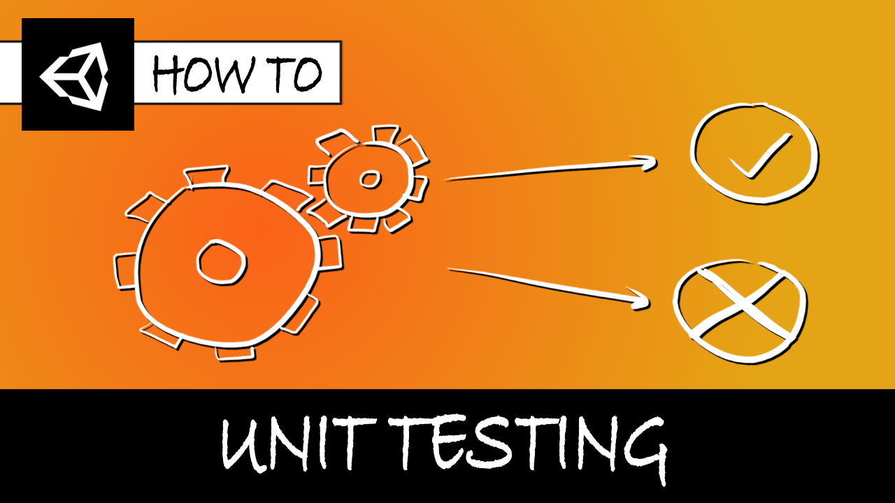

# [Unity/C#] Basic unit testing

**Mina Pêcheux - January 2022**

What is unit testing and how can we run basic C# unit tests in Unity using the official Test Framework package? Let's discover more in this video/text tutorial: "Do basic unit testing (Unity/C#)" :)

You can read it in text format [on Medium](https://mina-pecheux.medium.com/9de7f923d2ee), or watch it [on Youtube](https://youtu.be/pr5FBtu5SvQ).

In this less than 30 minutes-tutorial, I'm discussing what unit testing is, why it's interesting for game development (although not that frequent among game developers...) and how we can implement simple C# unit tests with the Unity Test Framework!

This Github repo contains the custom `Matrix` C# class and associated unit tests that I talk about in the tutorial :)
